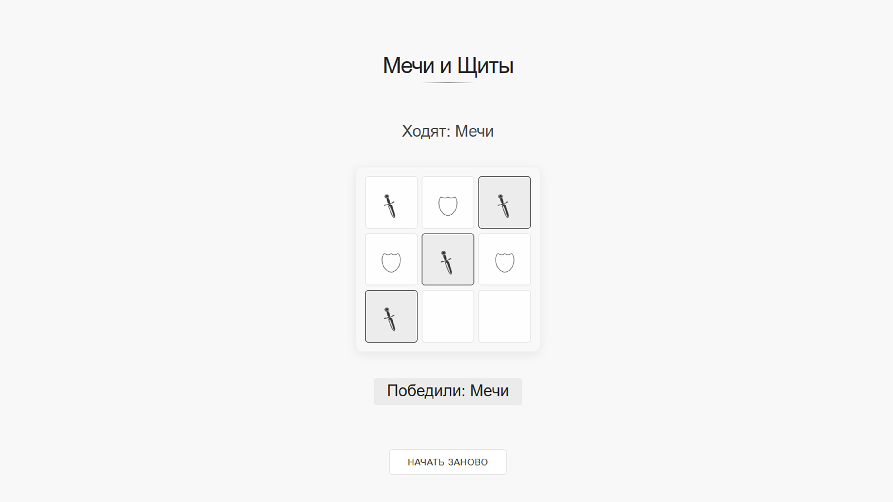

# 🗡️🛡️ Мечи и Щиты — классическая битва в современном стиле

**Мечи и Щиты** — это элегантная интерпретация классической игры "Крестики-нолики" с уникальным визуальным стилем и механикой. Сразитесь в тактическом поединке, где каждый ход может привести к победе!

## 🎮 Особенности игры

- **Минималистичный дизайн** в чёрно-белой гамме с анимациями
- **Две роли**: Мечи (⚔️) и Щиты (🛡) вместо классических X и O
- **Подсветка победной комбинации** — сразу видно, кто одержал победу
- **Адаптивный интерфейс**, одинаково красивый на любых устройствах
- **Быстрый рестарт** — новая игра в один клик

## 🏆 Правила

1. Игроки ходят по очереди, расставляя свои символы
2. Первый ход всегда за Мечами (⚔️)
3. Побеждает тот, кто первым выстроит:
   - 3 символа в ряд (горизонтально, вертикально или по диагонали)

## 🛠 Технологии

- **React** + **TypeScript**
- **Redux Toolkit** для управления состоянием
- **CSS** для стилизации

## 📱 Скриншот



## 🚀 Как запустить

1. Установите зависимости:

```bash
npm install
```

2. Запустите игру:

```bash
npm run dev
```

## 🌟 Особенности реализации

- **Оптимизированный алгоритм** проверки победных комбинаций
- **Анимации** появления символов и победной комбинации
- **Полная типизция** на TypeScript

## 🤝 Как можно улучшить

- Добавить подсчёт очков
- Реализовать историю ходов
- Сделать мультиплеер через WebSockets
- Добавить выбор размера поля (3x3, 5x5)

**Мечи и Щиты** — это не просто игра, это битва стратегий! Кто окажется сильнее — наступательные Мечи или защитные Щиты? Сыграйте и узнайте!
